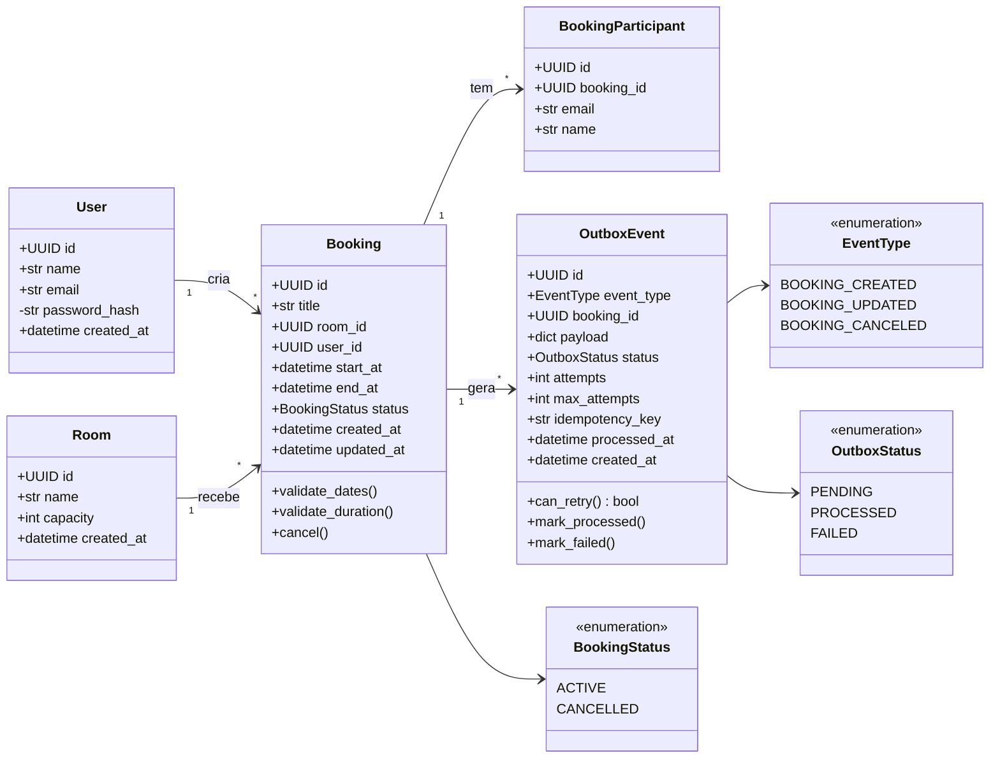
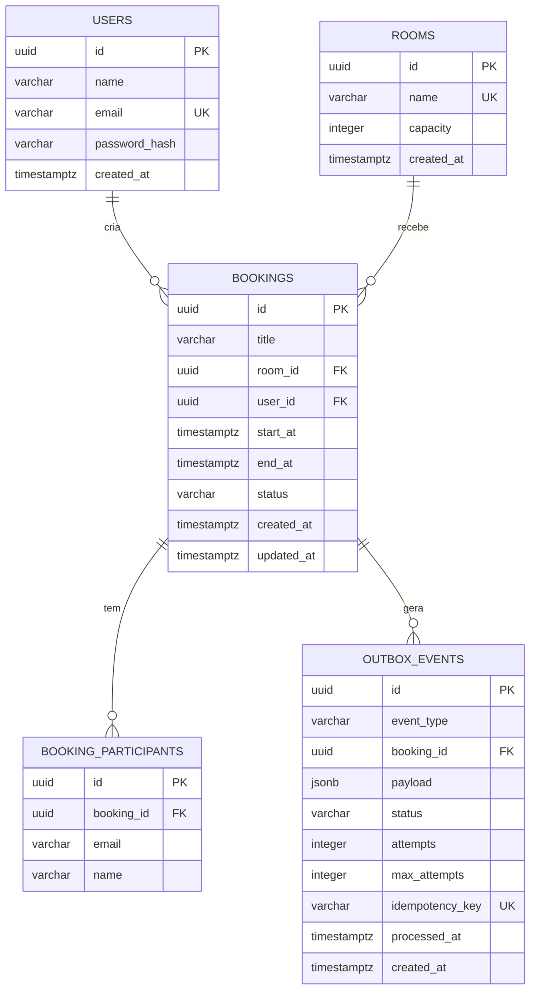

# 🏗️ Plano de Projeto — Meeting Room Booking System

---

## 1. Visão Geral da Arquitetura

```
┌─────────────┐     ┌─────────────────────────────────────────────┐
│   React SPA │────▶│              FastAPI (async)                 │
│  React Query│     │  Clean Architecture                         │
│  Context API│     │  ┌─────────┬──────────────┬──────────────┐  │
└─────────────┘     │  │ Routers │  Application │    Domain     │  │
                    │  │  (API)  │  (Services)  │  (Entities)  │  │
                    │  └────┬────┴──────┬───────┴──────────────┘  │
                    │       │           │                          │
                    │  ┌────▼───────────▼──────────────────────┐  │
                    │  │     Infrastructure (Repos, DB, etc)    │  │
                    │  └────────────┬───────────────────────────┘  │
                    └──────────────┼───────────────────────────────┘
                                   │
                    ┌──────────────▼───────────┐
                    │     PostgreSQL 16         │
                    │  (async via asyncpg)      │
                    └──────────────┬───────────┘
                                   │
                    ┌──────────────▼───────────┐
                    │     Redis 7               │
                    │  (Celery broker + result) │
                    └──────────────┬───────────┘
                                   │
                    ┌──────────────▼───────────┐
                    │   Celery Worker           │
                    │  (processa outbox events) │
                    │  → envia e-mail via SMTP  │
                    └──────────────┬───────────┘
                                   │
                    ┌──────────────▼───────────┐
                    │   Mailpit (SMTP + Web UI) │
                    │   localhost:8025          │
                    └──────────────────────────┘
```

---

## 2. Stack Detalhada

| Camada         | Tecnologia                          |
|----------------|-------------------------------------|
| Backend        | Python 3.12, FastAPI, Uvicorn       |
| ORM            | SQLAlchemy 2.0 (async, asyncpg)     |
| Migrations     | Alembic (async)                     |
| Auth           | JWT (python-jose + passlib/bcrypt)  |
| Worker         | Celery 5 + Redis broker             |
| E-mail         | aiosmtplib / smtplib (no worker)    |
| E-mail Server  | Mailpit (dev)                       |
| Database       | PostgreSQL 16                       |
| Frontend       | React 18, Vite, TypeScript          |
| State          | React Query + Context API           |
| HTTP Client    | Axios                               |
| UI             | Tailwind CSS (ou Chakra — livre)    |
| Infra          | Docker Compose                      |
| Testes BE      | Pytest + pytest-asyncio + httpx     |
| Testes FE      | Vitest + React Testing Library      |

---

## 3. Estrutura de Pastas

```
desafio-mailerweb/
├── docker-compose.yml
├── .env.example
├── README.md
│
├── backend/
│   ├── Dockerfile
│   ├── pyproject.toml          # ou requirements.txt
│   ├── alembic.ini
│   ├── alembic/
│   │   └── versions/
│   │
│   ├── app/
│   │   ├── main.py             # FastAPI app factory
│   │   ├── config.py           # Settings (pydantic-settings)
│   │   │
│   │   ├── domain/             # 🧠 Regras de negócio puras
│   │   │   ├── entities/
│   │   │   │   ├── user.py
│   │   │   │   ├── room.py
│   │   │   │   ├── booking.py
│   │   │   │   └── outbox_event.py
│   │   │   ├── exceptions.py   # DomainError, OverlapError, etc.
│   │   │   └── validators.py   # Validações de booking (datas, duração)
│   │   │
│   │   ├── application/        # 📋 Casos de uso / Services
│   │   │   ├── services/
│   │   │   │   ├── auth_service.py
│   │   │   │   ├── room_service.py
│   │   │   │   ├── booking_service.py
│   │   │   │   └── outbox_service.py
│   │   │   ├── schemas/        # Pydantic DTOs (request/response)
│   │   │   │   ├── auth.py
│   │   │   │   ├── room.py
│   │   │   │   ├── booking.py
│   │   │   │   └── outbox.py
│   │   │   └── interfaces/     # ABCs dos repositórios
│   │   │       ├── room_repository.py
│   │   │       ├── booking_repository.py
│   │   │       ├── user_repository.py
│   │   │       └── outbox_repository.py
│   │   │
│   │   ├── infrastructure/     # 🔌 Implementações concretas
│   │   │   ├── database/
│   │   │   │   ├── session.py      # async engine + sessionmaker
│   │   │   │   └── models.py       # SQLAlchemy ORM models
│   │   │   ├── repositories/
│   │   │   │   ├── sqlalchemy_room_repo.py
│   │   │   │   ├── sqlalchemy_booking_repo.py
│   │   │   │   ├── sqlalchemy_user_repo.py
│   │   │   │   └── sqlalchemy_outbox_repo.py
│   │   │   ├── security/
│   │   │   │   └── jwt.py          # create_token, decode_token
│   │   │   └── email/
│   │   │       └── smtp_sender.py  # envia e-mail via SMTP
│   │   │
│   │   ├── api/                # 🌐 Camada HTTP
│   │   │   ├── dependencies.py # get_db, get_current_user
│   │   │   ├── routers/
│   │   │   │   ├── auth.py
│   │   │   │   ├── rooms.py
│   │   │   │   └── bookings.py
│   │   │   └── middleware.py   # CORS, error handlers
│   │   │
│   │   └── worker/             # ⚙️ Celery
│   │       ├── celery_app.py   # Celery instance config
│   │       └── tasks.py        # process_outbox_events task
│   │
│   └── tests/
│       ├── conftest.py         # fixtures (async db, client, auth)
│       ├── unit/
│       │   ├── test_booking_validators.py
│       │   └── test_domain_rules.py
│       ├── integration/
│       │   ├── test_rooms_api.py
│       │   ├── test_bookings_api.py
│       │   ├── test_auth_api.py
│       │   ├── test_booking_overlap.py
│       │   └── test_outbox_creation.py
│       └── worker/
│           ├── test_outbox_processing.py
│           └── test_idempotency.py
│
├── frontend/
│   ├── Dockerfile
│   ├── package.json
│   ├── vite.config.ts
│   ├── tsconfig.json
│   ├── tailwind.config.js
│   │
│   ├── src/
│   │   ├── main.tsx
│   │   ├── App.tsx
│   │   │
│   │   ├── api/                # Axios instance + endpoints
│   │   │   ├── client.ts       # axios.create, interceptors
│   │   │   ├── auth.ts
│   │   │   ├── rooms.ts
│   │   │   └── bookings.ts
│   │   │
│   │   ├── contexts/
│   │   │   └── AuthContext.tsx  # JWT storage, user state
│   │   │
│   │   ├── hooks/
│   │   │   ├── useRooms.ts     # React Query hooks
│   │   │   ├── useBookings.ts
│   │   │   └── useAuth.ts
│   │   │
│   │   ├── pages/
│   │   │   ├── LoginPage.tsx
│   │   │   ├── RegisterPage.tsx
│   │   │   ├── RoomsPage.tsx
│   │   │   ├── RoomDetailPage.tsx
│   │   │   └── BookingFormPage.tsx
│   │   │
│   │   ├── components/
│   │   │   ├── Layout.tsx
│   │   │   ├── PrivateRoute.tsx
│   │   │   ├── RoomCard.tsx
│   │   │   ├── BookingList.tsx
│   │   │   ├── BookingForm.tsx
│   │   │   └── FeedbackToast.tsx
│   │   │
│   │   └── types/
│   │       └── index.ts        # Room, Booking, User types
│   │
│   └── tests/
│       ├── LoginPage.test.tsx
│       ├── BookingForm.test.tsx
│       └── RoomsPage.test.tsx
│
└── docs/
    └── DECISIONS.md            # Decisões técnicas documentadas
```

---

## 4. Diagrama de Classes — Entidades do Domínio

### Class Diagram



### ERD (Entity-Relationship Diagram)



### Entidades

#### `User`
Representa o usuário autenticado. Responsável por criar bookings. O `password_hash` fica encapsulado — nunca exposto na API.

#### `Room`
Sala de reunião com `name` (UNIQUE) e `capacity` (> 0). Entidade simples, sem lógica de negócio complexa.

#### `Booking`
Entidade central do domínio. Contém a lógica mais importante:
- **`validate_dates()`** — garante `start_at < end_at`, ambas ISO 8601 com timezone
- **`validate_duration()`** — mínimo 15min, máximo 8h
- **`cancel()`** — muda status para `CANCELLED` (soft delete)
- O **overlap** é validado no service (query) + constraint no banco (exclusion)
- `status` usa enum `BookingStatus` (ACTIVE / CANCELLED)

#### `BookingParticipant`
Participante de uma reserva, identificado por e-mail. É quem recebe as notificações. Separado do `User` porque participantes podem ser pessoas externas ao sistema.

#### `OutboxEvent`
Implementa o Transactional Outbox Pattern:
- **`can_retry()`** — `attempts < max_attempts` e `status != 'processed'`
- **`mark_processed()`** — seta `status='processed'` e `processed_at=now()`
- **`mark_failed()`** — incrementa `attempts`, seta `status='failed'` se esgotou
- **`idempotency_key`** (UNIQUE) — impede duplicação de eventos
- `event_type` usa enum: `BOOKING_CREATED`, `BOOKING_UPDATED`, `BOOKING_CANCELED`
- `payload` (JSONB) — snapshot dos dados no momento do evento (título, sala, horário, participantes)

### Relacionamentos

```
User  ──(1:N)──▶  Booking         # um usuário cria N reservas
Room  ──(1:N)──▶  Booking         # uma sala recebe N reservas
Booking ──(1:N)──▶ BookingParticipant  # uma reserva tem N participantes
Booking ──(1:N)──▶ OutboxEvent    # uma reserva gera N eventos (create, update, cancel)
```

### Decisões de Design

1. **Participantes separados de Users** — participantes de reunião podem ser e-mails externos. Isso simplifica o modelo e permite convidar qualquer pessoa.

2. **Payload como JSONB no OutboxEvent** — snapshot completo no momento do evento. Mesmo que o booking seja editado depois, o e-mail reflete o estado exato daquele evento. Desacopla o worker de queries adicionais.

3. **Idempotency key como UUID gerado no momento da criação do evento** — não depende de combinação booking_id + event_type (que permitiria duplicatas em edições múltiplas). Cada operação gera um UUID único.

4. **Soft delete em bookings** — `status='cancelled'` em vez de DELETE. Mantém histórico e permite que o outbox event de cancelamento referencie o booking.

---

## 5. Modelagem de Dados (SQL)

### users
| Coluna        | Tipo          | Constraints           |
|---------------|---------------|-----------------------|
| id            | UUID (PK)     | default uuid4         |
| name          | VARCHAR(255)  | NOT NULL              |
| email         | VARCHAR(255)  | UNIQUE, NOT NULL      |
| password_hash | VARCHAR(255)  | NOT NULL              |
| created_at    | TIMESTAMPTZ   | default now()         |

### rooms
| Coluna     | Tipo          | Constraints           |
|------------|---------------|-----------------------|
| id         | UUID (PK)     | default uuid4         |
| name       | VARCHAR(255)  | UNIQUE, NOT NULL      |
| capacity   | INTEGER       | NOT NULL, CHECK > 0   |
| created_at | TIMESTAMPTZ   | default now()         |

### bookings
| Coluna      | Tipo          | Constraints                       |
|-------------|---------------|-----------------------------------|
| id          | UUID (PK)     | default uuid4                     |
| title       | VARCHAR(255)  | NOT NULL                          |
| room_id     | UUID (FK)     | → rooms.id                        |
| user_id     | UUID (FK)     | → users.id (quem criou)           |
| start_at    | TIMESTAMPTZ   | NOT NULL                          |
| end_at      | TIMESTAMPTZ   | NOT NULL                          |
| status      | VARCHAR(20)   | 'active' / 'cancelled'            |
| created_at  | TIMESTAMPTZ   | default now()                     |
| updated_at  | TIMESTAMPTZ   | default now(), onupdate now()     |

**Constraint de exclusão (PostgreSQL):**
```sql
-- Impede overlap no nível do banco (concorrência)
ALTER TABLE bookings
ADD CONSTRAINT no_overlap
EXCLUDE USING gist (
    room_id WITH =,
    tstzrange(start_at, end_at, '[)') WITH &&
) WHERE (status = 'active');
```
> Requer extensão `btree_gist`.

### booking_participants
| Coluna      | Tipo       | Constraints           |
|-------------|------------|-----------------------|
| id          | UUID (PK)  | default uuid4         |
| booking_id  | UUID (FK)  | → bookings.id         |
| email       | VARCHAR    | NOT NULL              |
| name        | VARCHAR    | NULL (opcional)        |

### outbox_events
| Coluna        | Tipo          | Constraints                        |
|---------------|---------------|------------------------------------|
| id            | UUID (PK)     | default uuid4                      |
| event_type    | VARCHAR(50)   | BOOKING_CREATED/UPDATED/CANCELED   |
| booking_id    | UUID (FK)     | → bookings.id                      |
| payload       | JSONB         | dados do e-mail (título, sala...)  |
| status        | VARCHAR(20)   | 'pending' / 'processed' / 'failed' |
| attempts      | INTEGER       | default 0                          |
| max_attempts  | INTEGER       | default 5                          |
| processed_at  | TIMESTAMPTZ   | NULL até processar                 |
| created_at    | TIMESTAMPTZ   | default now()                      |
| idempotency_key | VARCHAR     | UNIQUE — evita duplicação          |

---

## 6. Endpoints da API

### Auth
| Método | Rota              | Descrição         | Auth |
|--------|-------------------|--------------------|------|
| POST   | /api/auth/register | Criar conta       | ❌   |
| POST   | /api/auth/login    | Login → JWT token | ❌   |
| GET    | /api/auth/me       | Dados do usuário  | ✅   |

### Rooms
| Método | Rota              | Descrição              | Auth |
|--------|-------------------|------------------------|------|
| POST   | /api/rooms        | Criar sala             | ✅   |
| GET    | /api/rooms        | Listar salas           | ✅   |
| GET    | /api/rooms/:id    | Detalhes da sala       | ✅   |

### Bookings
| Método | Rota                      | Descrição             | Auth |
|--------|---------------------------|-----------------------|------|
| POST   | /api/bookings             | Criar reserva         | ✅   |
| GET    | /api/bookings             | Listar reservas       | ✅   |
| GET    | /api/bookings/:id         | Detalhes da reserva   | ✅   |
| PUT    | /api/bookings/:id         | Editar reserva        | ✅   |
| PATCH  | /api/bookings/:id/cancel  | Cancelar reserva      | ✅   |

---

## 7. Estratégia de Concorrência (Documentar no README)

Três camadas de proteção:

1. **Validação na Application Layer** — query prévia para checar overlap antes de inserir.
2. **Exclusion Constraint no PostgreSQL** — `EXCLUDE USING gist` com `tstzrange` garante atomicidade no banco. Mesmo que duas requests passem pela validação da app simultaneamente, o banco rejeita a segunda.
3. **Transação atômica** — booking + outbox_event são criados na mesma transação. Se qualquer parte falhar, tudo faz rollback.

```
Request A ──▶ Service valida ──▶ INSERT booking ──▶ ✅ COMMIT
Request B ──▶ Service valida ──▶ INSERT booking ──▶ ❌ ExclusionViolation → 409 Conflict
```

---

## 8. Fluxo do Outbox + Worker

```
1. Usuário cria/edita/cancela reserva
2. Service abre transação:
   a. INSERT/UPDATE booking
   b. INSERT outbox_event (status='pending', idempotency_key=uuid)
   c. COMMIT (atômico)
3. Celery Beat (ou polling) dispara task periodicamente
4. Worker:
   a. SELECT outbox_events WHERE status='pending' AND attempts < max_attempts
      FOR UPDATE SKIP LOCKED  ← evita que dois workers peguem o mesmo
   b. Para cada evento:
      - Monta e-mail (título, sala, horário, tipo de evento)
      - Envia via SMTP (Mailpit)
      - Se sucesso → status='processed', processed_at=now()
      - Se falha → attempts += 1, se attempts >= max → status='failed'
5. Idempotência: idempotency_key UNIQUE garante que o mesmo evento
   não gera duas entradas. Worker checa status antes de enviar.
```

---

## 9. Docker Compose — Serviços

```yaml
services:
  db:          # PostgreSQL 16
  redis:       # Redis 7 (broker Celery)
  mailpit:     # SMTP mock + Web UI (:8025)
  backend:     # FastAPI + Uvicorn
  worker:      # Celery worker
  beat:        # Celery beat (scheduler)
  frontend:    # React (Vite dev server)
```

Portas planejadas:
- `5432` — PostgreSQL
- `6379` — Redis
- `8000` — FastAPI
- `8025` — Mailpit Web UI
- `1025` — Mailpit SMTP
- `5173` — React dev

---

## 10. Variáveis de Ambiente (.env)

```env
# Database
DATABASE_URL=postgresql+asyncpg://user:pass@db:5432/meetings

# Redis
REDIS_URL=redis://redis:6379/0

# JWT
JWT_SECRET_KEY=super-secret-key-change-me
JWT_ALGORITHM=HS256
JWT_EXPIRATION_MINUTES=60

# SMTP (Mailpit)
SMTP_HOST=mailpit
SMTP_PORT=1025
SMTP_FROM=noreply@meetingrooms.local

# Celery
CELERY_BROKER_URL=redis://redis:6379/0
CELERY_RESULT_BACKEND=redis://redis:6379/1
```

---

## 11. Fases de Implementação

### FASE 1 — Infraestrutura Base ⏱️ ~2h
- [ ] Docker Compose (db, redis, mailpit)
- [ ] Projeto Python (pyproject.toml, dependências)
- [ ] SQLAlchemy async engine + session
- [ ] Alembic configurado (async)
- [ ] Config com pydantic-settings
- [ ] FastAPI app factory + CORS

### FASE 2 — Domain + Models ⏱️ ~2h
- [ ] Entities (User, Room, Booking, OutboxEvent)
- [ ] SQLAlchemy ORM models
- [ ] Validators (datas, duração, overlap)
- [ ] Domain exceptions
- [ ] Migration inicial (Alembic)
- [ ] Exclusion constraint (btree_gist)

### FASE 3 — Auth ⏱️ ~1.5h
- [ ] User repository (interface + SQLAlchemy)
- [ ] Auth service (register, login, hash password)
- [ ] JWT utils (create/decode token)
- [ ] Auth router (POST /register, POST /login, GET /me)
- [ ] Dependency `get_current_user`
- [ ] Testes auth

### FASE 4 — Rooms ⏱️ ~1h
- [ ] Room repository
- [ ] Room service
- [ ] Room router (CRUD)
- [ ] Schemas (request/response)
- [ ] Testes rooms

### FASE 5 — Bookings ⏱️ ~3h
- [ ] Booking repository (com overlap check)
- [ ] Booking service (criar, editar, cancelar)
- [ ] Transação atômica (booking + outbox)
- [ ] Booking router
- [ ] Schemas
- [ ] Tratar ExclusionViolation → 409
- [ ] Testes: overlap, validações, concorrência

### FASE 6 — Outbox + Celery Worker ⏱️ ~2.5h
- [ ] Outbox repository
- [ ] Celery app config
- [ ] Task: `process_pending_events`
- [ ] SMTP sender (Mailpit)
- [ ] Celery Beat schedule (a cada 10s)
- [ ] Retry logic + idempotência
- [ ] `FOR UPDATE SKIP LOCKED`
- [ ] Testes: processamento, retry, idempotência

### FASE 7 — Frontend ⏱️ ~4h
- [ ] Projeto React + Vite + TypeScript
- [ ] Tailwind CSS setup
- [ ] Axios client + interceptors JWT
- [ ] AuthContext (login, register, logout, token)
- [ ] React Query provider
- [ ] Pages: Login, Register, Rooms, BookingForm
- [ ] Components: RoomCard, BookingList, BookingForm
- [ ] PrivateRoute
- [ ] Feedback: loading, toasts, erros
- [ ] Dockerfile

### FASE 8 — Testes Frontend ⏱️ ~1.5h
- [ ] Vitest + RTL setup
- [ ] Test: LoginPage
- [ ] Test: BookingForm (criar + erro overlap)
- [ ] Test: RoomsPage

### FASE 9 — Polish ⏱️ ~1.5h
- [ ] README completo
- [ ] DECISIONS.md (concorrência, outbox, clean arch)
- [ ] .env.example
- [ ] Docker Compose full (todos os serviços)
- [ ] Smoke test end-to-end
- [ ] Linting (ruff/black + eslint)

---

## 12. Decisões Técnicas a Documentar

1. **Clean Architecture** — separação em domain/application/infrastructure para testabilidade e independência de framework.

2. **Exclusion Constraint** — escolhido sobre `SELECT FOR UPDATE` puro porque garante integridade no nível do banco, imune a race conditions da aplicação.

3. **Outbox Pattern** — garante consistência entre a operação de negócio e o envio de notificação. Sem risco de enviar e-mail e o booking falhar (ou vice-versa).

4. **`FOR UPDATE SKIP LOCKED`** — permite escalar para múltiplos workers sem duplicar processamento.

5. **Idempotency Key** — cada evento recebe um UUID único. Worker verifica status antes de enviar. Constraint UNIQUE no banco.

6. **Celery Beat** — polling periódico (10s) é simples e confiável. Alternativa seria disparo direto após commit, mas o polling é mais resiliente a falhas.

7. **SQLAlchemy 2.0 Async** — asyncpg para máximo throughput no I/O. Alembic roda migrations em modo async.

8. **Mailpit** — substituto leve do Mailtrap para dev. Captura todos os e-mails em `localhost:8025`.

---

## 13. Estimativa Total

| Fase              | Tempo estimado |
|-------------------|----------------|
| Infraestrutura    | 2h             |
| Domain + Models   | 2h             |
| Auth              | 1.5h           |
| Rooms             | 1h             |
| Bookings          | 3h             |
| Outbox + Worker   | 2.5h           |
| Frontend          | 4h             |
| Testes Frontend   | 1.5h           |
| Polish            | 1.5h           |
| **Total**         | **~19h**       |

Considerando imprevistos e debugging: **~22-24h de trabalho efetivo**, confortável dentro dos 3 dias.

